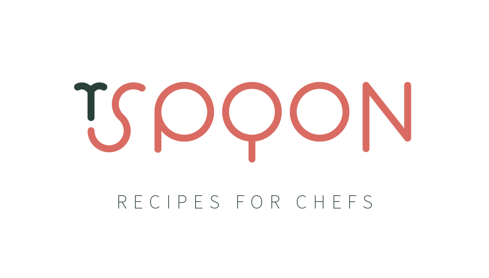

<a name="readme-top"></a>
<!-- PROJECT SHIELDS -->
<!--
*** I'm using markdown "reference style" links for readability.
*** Reference links are enclosed in brackets [ ] instead of parentheses ( ).
*** See the bottom of this document for the declaration of the reference variables
*** for contributors-url, forks-url, etc. This is an optional, concise syntax you may use.
*** https://www.markdownguide.org/basic-syntax/#reference-style-links
-->
<!-- [![Contributors][contributors-shield]][contributors-url]
[![Issues][issues-shield]][issues-url]
[![MIT License][license-shield]][license-url] -->


<!-- PROJECT LOGO -->
<div align="center">
    <a href="https://www.tspoonapp.com" target="blank">
        
    </a>
    <p align="center">
        <a href="https://www.tspoonapp.com/" target="blank">View Project</a>
        ·
        <a href="https://github.com/dicristea/tspoon-web/issues/new?labels=bug&template=bug-report---.md" target="blank">Report Bug</a>
        ·
        <a href="https://github.com/dicristea/tspoon-web/issues/new?labels=enhancement&template=feature-request---.md" target="blank">Request Feature</a>
    </p>
</div>


<!-- TABLE OF CONTENTS -->
<details>   
  <summary>Table of Contents</summary>
  <ol>
    <li>
      <a href="#about-the-project">About The Project</a>
      <ul>
        <li><a href="#built-with">Built With</a></li>
      </ul>
    </li>
    <!-- <li>
      <a href="#getting-started">Getting Started</a>
      <ul>
        <li><a href="#prerequisites">Prerequisites</a></li>
        <li><a href="#installation">Installation</a></li>
      </ul>
    </li> -->
    <!-- <li><a href="#usage">Usage</a></li> -->
    <li><a href="#roadmap">Roadmap</a></li>
    <li><a href="#license">License</a></li>
    <li><a href="#contact">Contact</a></li>
    <li><a href="#acknowledgments">Acknowledgments</a></li>
  </ol>
</details>


<!-- ABOUT THE PROJECT -->
## About The Project

[![Product Name Screen Shot][product-screenshot]](https://tspoonapp.com)

<p align="left">
    <b>Tspoon</b> is a recipe sharing social media platform aimed at Chefs of all levels from amateur to professional who are creating their own personal brands as Chefs. <b>Tspoon’s</b> mission is to provide a platform for all Chefs to share their culinary journeys! 
</p>
<p align='left'>
    <b>Tspoon</b> will be a free app that offers an array of recipes that cater to different dietary needs and preferences. Users can set filters for their preferences such as cuisine type, cooking time, and diet. Our mission is to provide an enjoyable and effortless cooking experience for anyone using our platform. 
</p>
<p align='left'>
    <b>Tspoon Chefs</b> will never need to find a recipe again. Instead, the recipes they love will find them.
</p>

<p align='center'>Join our <a href="https://www.tspoonapp.com/" target="blank">Mailing List</a> to stay updated!</p>
<p align="center">
    <a href="https://www.instagram.com/tspoonapp/" target="blank">
        
    </a>
    <a href="https://www.tiktok.com/@tspoon.app" target="blank">
        
    </a>
</p>
<p align="center">
    © 2024 <a href="https://www.tspoonapp.com/" target="blank">Tspoon, LLC.</a>
</p>


<p align="right"><a href="#readme-top">back to top</a></p>


### Built With

* [![React][React.js]][React-url]
    - [npm: react-router-dom](https://www.npmjs.com/package/react-router-dom)
    - [npm: @fontsource/source-sans-pro](https://www.npmjs.com/package/@fontsource/source-sans-pro)
    - [npm: @linaria/react](https://www.npmjs.com/package/@linaria/react)
    - Eslint+Prettier


- [emailjs.com](https://www.emailjs.com/)
- [Autocomplete for Linaria](https://marketplace.visualstudio.com/items?itemName=styled-components.vscode-styled-components)
- [Simple Icons](https://simpleicons.org/)
- <a href="https://www.flaticon.com/free-icons/tiktok" title="tiktok icons">Tiktok icons created by Freepik - Flaticon</a>


<p align="right"><a href="#readme-top">back to top</a></p>


<!-- GETTING STARTED -->
<!-- ## Getting Started

This is an example of how you may give instructions on setting up your project locally.
To get a local copy up and running follow these simple example steps.

### Prerequisites

This is an example of how to list things you need to use the software and how to install them.
* npm
  ```sh
  npm install npm@latest -g
  ```

### Installation

1. Get a free API Key at [https://example.com](https://example.com)
2. Clone the repo
   ```sh
   git clone https://github.com/dicristea/tspoon-web.git
   ```
3. Install NPM packages
   ```sh
   npm install
   ```
4. Enter your API in `config.js`
   ```js
   const API_KEY = 'ENTER YOUR API';
   ```

<p align="right"><a href="#readme-top">back to top</a></p>
 -->


<!-- USAGE EXAMPLES -->
<!-- ## Usage

Use this space to show useful examples of how a project can be used. Additional screenshots, code examples and demos work well in this space. You may also link to more resources.

_For more examples, please refer to the [Documentation](https://example.com)_

<p align="right"><a href="#readme-top">back to top</a></p>

 -->


## Roadmap

- [x] App Preview
- [x] Download the app from Google Play!
- [ ] Download the app from Apple Store!
- [ ] Scroll Animations

See the [open issues](https://github.com/dicristea/tspoon-web/issues) for a full list of proposed features (and known issues).

<p align="right"><a href="#readme-top">back to top</a></p>


## Contact me
<p align="left">Diana Cristea - dicristea111@gmail.com</p>

[![LinkedIn][linkedin-shield]][linkedin-diana-url]

[Contact Tspoon](https://www.tspoonapp.com/#/contact)

<p align="right"><a href="#readme-top">back to top</a></p>


## Acknowledgments

* Forest Hu [![GitHub][github-shield]][github-forest-url] [![LinkedIn][linkedin-shield]][linkedin-forest-url]
* [Andrew Gao][![LinkedIn][linkedin-shield]][linkedin-andrew-url]
* [Pauline Yang][![LinkedIn][linkedin-shield]][linkedin-paul-url]

<p align="right"><a href="#readme-top">back to top</a></p>


## License

Distributed under the MIT License. See `LICENSE.txt` for more information.

<p align="right"><a href="#readme-top">back to top</a></p>

<!-- https://www.markdownguide.org/basic-syntax/#reference-style-links -->

<!-- [contributors-shield]: https://img.shields.io/github/contributors/dicristea/tspoon-web.svg?style=for-the-badge
[contributors-url]: https://github.com/dicristea/tspoon-web/graphs/contributors
[issues-shield]: https://img.shields.io/github/issues/dicristea/tspoon-web.svg?style=for-the-badge
[issues-url]: https://github.com/dicristea/tspoon-web/issues -->
<!-- [license-shield]: https://img.shields.io/github/license/dicristea/tspoon-web.svg?style=for-the-badge
[license-url]: https://github.com/dicristea/tspoon-web/blob/master/LICENSE.txt -->
[linkedin-shield]: https://img.shields.io/badge/linkedin-%230077B5.svg?style=for-the-badge&logo=linkedin&logoColor=white
[linkedin-diana-url]: https://linkedin.com/in/dicristea
[linkedin-forest-url]: https://linkedin.com/in/foresthu
[linkedin-andrew-url]: https://www.linkedin.com/in/andrew-gao
[linkedin-paul-url]: https://www.linkedin.com/in/pauline-hyejin-yang


[github-shield]: https://img.shields.io/badge/github-%23121011.svg?style=for-the-badge&logo=github&logoColor=white
[github-forest-url]: https://github.com/foresthu2006/
[product-screenshot]: ./src/assets/Tspoon_Site_Preview.png
[React.js]: https://img.shields.io/badge/React-20232A?style=for-the-badge&logo=react&logoColor=61DAFB
[React-url]: https://reactjs.org/
